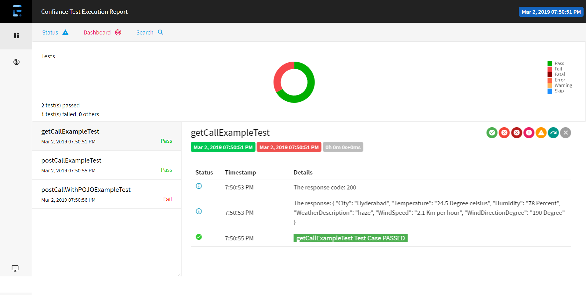
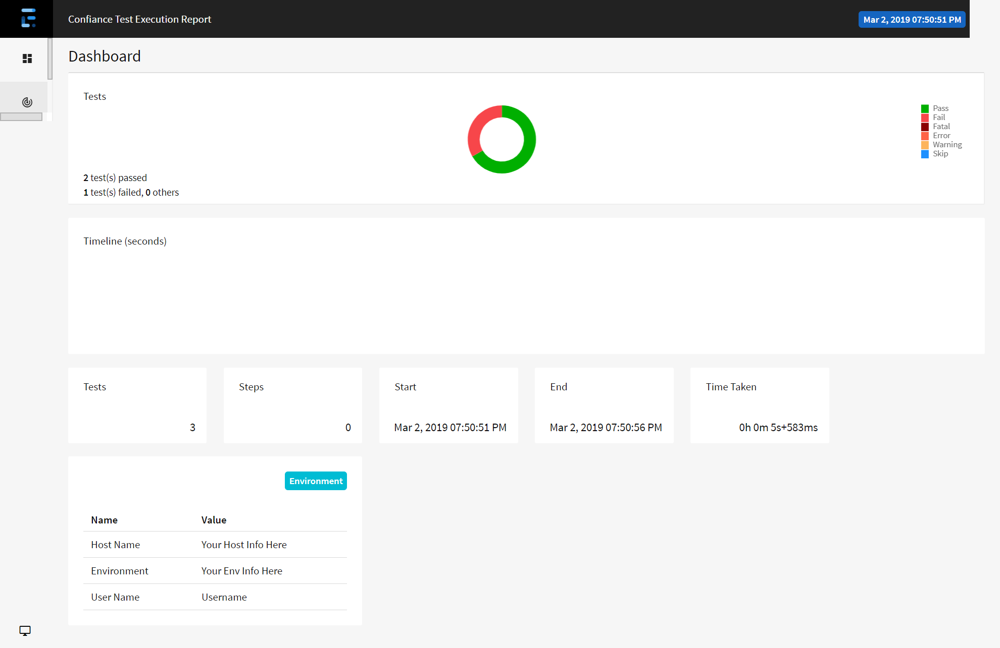

## Confiance API Automation Framework

#### Introduction:
Welcome to Confiance API Automation Framework. This is very simple yet powerful automation framework for RESTful WebServices automation based on JAVA.


Tools & libraries
--------------------------------------
1. Rest-Assured
2. Maven 
3. TestNG
4. Jackson for POJO class mapping
5. org.json for response parsing
6. Jxl to extract test data from Excel files
7. Extent Reports

How it works
---------------------------------------
* This project is already uploaded to Maven central repo. So, just add the below dependency to your POM.xml. 
   ```xml
   <dependency>
     <groupId>com.github.nainappa</groupId>
     <artifactId>confiance-api</artifactId>
     <version>1.0.2</version>
  </dependency> 
  
   ```
* Perform ```mvn clean install```
* You can start writing your test cases now.
* The sample Tests in the repo will help you to get start. All Sample tests run against http://restapi.demoqa.com/customer/register. 

Main features
----------------------------
1. Containerized implementation for response body, headers and cookies etc. Response object provided by the each type of method will have all these embedded with it. You can access any data that you need from this object. This helps users not to duplicate their code for any data. 

2. You can also get direct pojo as response. You just need to pass the corresponding response pojo class as parameter to the method.

3. Generates excellent execution reports using Extent Reports.
 
4. Utilizes the capabilities of TestNG such as Data provider annotation to separate test data in external file and flexible test suites configuration and management.

5. This also has utilities such as Reading data from excel sheets, Date utilities, Random data generators which are most frequently used utils in API automation.

Reporting
------------
This framework generates default TestNG Html reports as we use TestNG framework. It also generates very attractive and comprehensive [Extent Reports][1]. To get Extent Report, add the below listener to your testng.xml

```xml
<listeners>
   <listener class-name="com.confiance.framework.api.report.ExtentReportListener"/>
</listeners>
```
Along with the listener,there are also few parameters which you have to send from your TestNG.xml file for reports.
1. ``` archive.confiance.report ```
If you want to archive the reports send value 'true' (Your reports would be generated under  ```C:\Users\#urusrname#\Confiance_Execution_Reports\yyyy\mm\ddMMMyy_hhmmss_TestExecution\ConfianceExecutionReport.html```). Otherwise you can ignore this parameter.

2. ``` confiance.report.host ```
You can add the host information on which you are running your tests. This information would be shown in Dashboard view of Extent Report. You can ignore it, if you don't want.

3. ``` confiance.report.env ```
You can add the Environment information on which you are running your tests. This information would be shown in Dashboard view of Extent Report. You can ignore it, if you don't want.

4. ``` confiance.report.reportheader ```
If you want to customize the Report header, you can use this parameter in your TestNg.xml file. You can also choose not to add any name. By default, it shows "Confiance Execution Report" as the header. 

For adding log in your test method, use the object ``` ExtentReportUtil.logger ```. This has several options like info, debug, error etc. Please refer the test case example in the repo.

### Extent Reports Test case view:

## Extent Reports Dash Board view:


Feedback & Enhancements
-----------------------
If you want to report any issues or enhancements, please do so in the issue tracker. I'd love to hear what you think, so please take a moment to let me know.

Future Work
------------
1. Supporting SOAP APIs testing
2. supporting various DBs such as SQL, Mongo etc 
3. Supporting Behavior-driven development (BDD) test cases

[1]: http://extentreports.com/docs/versions/3/java/ "Extent Reports"
